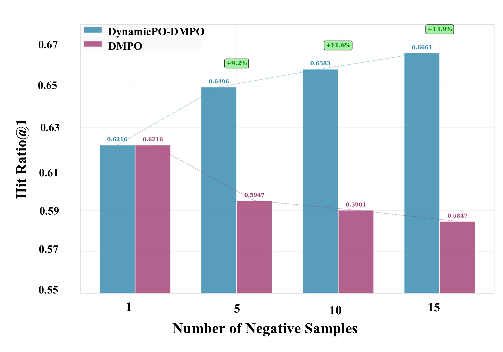
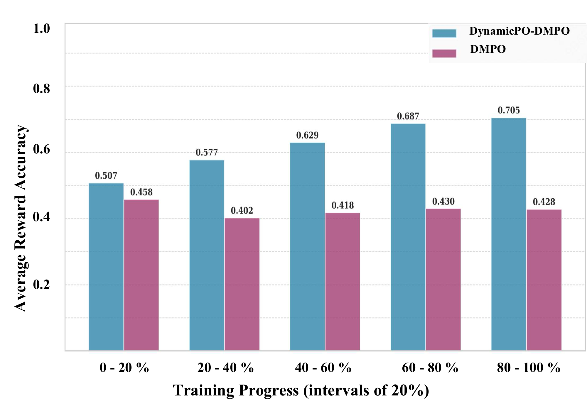

# DynamicPO

> Code for "**DynamicPO: Dynamic Preference Optimization for Recommendation**"
>
> [](https://dasfaa2026.github.io/program/awards.html)

**DynamicPO** is a lightweight, plug-and-play preference optimization framework for LLM-based recommender systems.

### What is the problem?

Recent multi-negative preference optimization methods suggest that using more negative samples can provide richer preference signals and improve recommendation performance. However, our empirical study reveals a counterintuitive phenomenon: when the number of negatives continues to increase, recommendation performance can degrade even though the training loss keeps decreasing. We refer to this as **preference optimization collapse**.

### Why does collapse happen?

We find that this collapse is caused by an imbalance between two types of negatives. After SFT, the model already has a coarse-grained ability to distinguish many negatives from positives. As a result, **model-discriminative negatives** dominate the aggregated optimization signal, while **boundary-critical negatives**, which are truly useful for refining user preference boundaries, are diluted and under-optimized.

### What does this suggest?

- More negative samples do not always lead to better preference optimization.
- **Model-discriminative negatives** can dominate the aggregated optimization signal, while **boundary-critical negatives** are under-emphasized.
- Dynamically selecting **boundary-critical negatives** and adaptively adjusting their optimization strength can lead to more effective preference-boundary refinement.

### How does DynamicPO address it?

To address this issue, DynamicPO dynamically selects **boundary-critical negatives** that are most helpful for decision-boundary refinement and adaptively adjusts the optimization strength for each selected negative. This enables more robust preference-boundary learning, effectively mitigates **preference optimization collapse**, and improves recommendation performance across multiple multi-negative preference optimization objectives with **negligible computational overhead**.

## Installation

### Requirements

- Python: `>=3.9`
- PyTorch: `2.4.0` or later
- Transformers: `4.43.3`
- Recommended hardware: we recommend 4 NVIDIA GPUs, such as A100, H100, or H200

### Install Dependencies

Install dependencies with:

```bash
pip install -r requirements.txt
```

## Data Preparation

Extract the LastFM dataset:

```bash
cd ./data
unzip lastfm-sft-cans20.zip
```

After extraction, the processed LastFM data will be available under `./data/`.
The extracted files include the training and validation splits used for SFT and preference optimization.

Our data preprocessing and construction pipeline follows prior LLM-based recommendation work, mainly based on [LLaRA](https://arxiv.org/pdf/2312.02445) and [S-DPO](https://arxiv.org/pdf/2406.09215).
Currently, we provide the processed **LastFM** data for quick reproduction.
We recommend that future researchers use **LastFM** first when validating their ideas and reproducing the pipeline, and only then move to **Goodreads** and **Steam**, since these two datasets usually require more computation than **LastFM**.

## Quick Start

The main experiment in this repository is the **DMPO-based DynamicPO pipeline**. We provide separate scripts for:

- `DMPO` baseline
- `DynamicPO_DMPO` main experiment

### Step 1. Supervised Fine-tuning (SFT)

Run:

```bash
sh ./scripts/01_sft/sft.sh
```

This produces the SFT checkpoint used by the preference-optimization stage.

### Step 2. Preference Optimization

For the DMPO baseline, run:

```bash
sh ./scripts/02_preference_optimization/DMPO.sh
```

For the DynamicPO-DMPO main experiment, run:

```bash
sh ./scripts/02_preference_optimization/DynamicPO_DMPO.sh
```

Both scripts launch `DynamicPO.py`, which uses `trainer/dynamicpo_trainer.py`.

Before running the scripts, please check the following variables:

- `MODEL_NAME`: path or name of the base model
- `SFT_CHECKPOINT`: path to the SFT checkpoint
- `NEG_NUM`: number of negative samples, set to **`15`** in our main experiments

The scripts already contain the recommended training settings. In most cases, you only need to update `MODEL_NAME` and `SFT_CHECKPOINT`.

### Step 3. Inference

Run:

```bash
sh ./scripts/03_inference/inference.sh
```

You may append `&` to run the scripts in the background.

## Results

A compact summary of the most important tables is shown below. The following tables report `HitRatio@1`.

For the broader comparison setting, we follow previous research for the traditional and LLM-based baselines and report their results, particularly under the benchmark construction and evaluation protocols adopted in LLaRA and S-DPO. Please refer to our arXiv paper for the full main-experiment comparison.

> [!TIP]
> We have also recently reproduced our experiments on **NVIDIA H200** GPUs and are organizing the corresponding checkpoints for release on **Hugging Face**. In our recent runs, we found that results on H200 can even be slightly better than the A100-based results reported in the paper. Therefore, small reproduction differences across environments, such as **CUDA / NVCC versions** and **GPU types** (for example, A100, H100, or H200), are normal and should be expected.

### Main Comparison

#### DMPO

| Variant | LastFM HR@1 | Goodreads HR@1 | Steam HR@1 |
| --- | ---: | ---: | ---: |
| Vanilla | 0.5848 | 0.5349 | 0.6383 |
| DynamicPO | 0.6661 | 0.6728 | 0.6990 |

### Cross-backbone Generalization

| Base Model | Variant | LastFM HR@1 | Goodreads HR@1 |
| --- | --- | ---: | ---: |
| Llama3-8B-Instruct | Vanilla | 0.6232 | 0.6645 |
| Llama3-8B-Instruct | DynamicPO | 0.7331 | 0.7641 |
| Qwen2.5-7B-Instruct | Vanilla | 0.5892 | 0.6617 |
| Qwen2.5-7B-Instruct | DynamicPO | 0.6433 | 0.7359 |

### Efficiency

| Base Model | Vanilla DMPO | DynamicPO | Overhead |
| --- | --- | --- | --- |
| Llama2-7b-hf | 4·A100 × 16h38min | 4·A100 × 16h41min | +3min |
| Llama3-8B-Instruct | 4·A100 × 15h29min | 4·A100 × 15h42min | +13min |
| Qwen2.5-7B-Instruct | 4·A100 × 14h49min | 4·A100 × 14h57min | +8min |
| Average | 62.58 h·A100 | 63.11 h·A100 | +0.85% |

The first figure shows how the recommendation performance of vanilla DMPO and DynamicPO changes as the number of negative samples increases.



The second figure shows how the reward winner rate evolves during training for vanilla DMPO and DynamicPO.




## Supplementary Multi-objective Experiments

The supplementary exploratory study provides additional scripts for evaluating DynamicPO on other multi-negative preference optimization objectives. These experiments are **not the main reproduction path** of the paper, but they help readers examine whether the DynamicPO idea can **generalize beyond the main DMPO setting**.

### MPPO and S-DPO Extensions

It includes two objective families:

- MPPO and DynamicPO-MPPO
- S-DPO and DynamicPO-S-DPO

The runnable entrypoint is `exploratory_study.py`, which uses `trainer/exploratory_study_trainer.py`.

### Supplementary Results

#### MPPO

| Variant | LastFM HR@1 | Goodreads HR@1 | Steam HR@1 |
| --- | ---: | ---: | ---: |
| Vanilla | 0.6597 | 0.6993 | 0.7614 |
| DynamicPO | 0.6906 | 0.7226 | 0.8069 |

#### S-DPO

| Variant | LastFM HR@1 | Goodreads HR@1 | Steam HR@1 |
| --- | ---: | ---: | ---: |
| Vanilla | 0.6617 | 0.6778 | 0.6948 |
| DynamicPO | 0.6666 | 0.6843 | 0.6998 |

### Reproducing Supplementary Comparisons

Run one of the following scripts depending on the objective family you want to reproduce:

```bash
sh ./scripts/04_exploratory_study/MPPO/MPPO.sh
sh ./scripts/04_exploratory_study/MPPO/DynamicPO_MPPO.sh
sh ./scripts/04_exploratory_study/SDPO/SDPO.sh
sh ./scripts/04_exploratory_study/SDPO/DynamicPO_SDPO.sh
```

These scripts correspond to:

- `MPPO`: the MPPO baseline
- `DynamicPO_MPPO`: MPPO enhanced with DynamicPO
- `SDPO`: the S-DPO baseline
- `DynamicPO_SDPO`: S-DPO enhanced with DynamicPO

The exploratory scripts already include the settings used in our supplementary comparison. In most cases, you only need to check `MODEL_NAME` and `SFT_CHECKPOINT` before running them. Their key hyperparameters are aligned with the main setup, including `beta=1.0`, `neg_num=15`, `batch_size=4`, `gradient_accumulation_steps=8`, `learning_rate=1e-5`, and `num_train_epochs=3`.

### Configuration

For MPPO-family experiments:

- `filter_mode="MPPO"` corresponds to the MPPO baseline.
- `filter_mode="DynamicPO_MPPO"` corresponds to DynamicPO-MPPO.
- `loss_type="wo_ref"` should be used.

For S-DPO-family experiments:

- `filter_mode="SDPO"` corresponds to the S-DPO baseline.
- `filter_mode="DynamicPO_SDPO"` corresponds to DynamicPO-S-DPO.
- `loss_type="w_ref"` should be used.

### How to Read and Reproduce the Supplementary Comparisons

For a clear comparison, we suggest reproducing each objective family as a pair:

1. `MPPO` vs. `DynamicPO_MPPO`
2. `SDPO` vs. `DynamicPO_SDPO`

Readers can also vary the number of negative samples, such as `1`, `3`, `5`, `10`, and `15`, to examine how preference-optimization collapse changes under different multi-negative settings.

### What We Learned from the Supplementary Experiments

#### Did DMPO, MPPO, and S-DPO exhibit the same collapse pattern?

In the supplementary exploratory study, we observed **clear preference-optimization collapse** phenomena in DMPO and MPPO. In contrast, we did **not observe a similarly clear collapse pattern** for S-DPO under the tested settings.

#### Does the absence of obvious collapse in S-DPO mean it is the best objective?

Our current interpretation is that different multi-negative preference optimization objectives may respond differently to larger negative sets. In particular, the softmax-based objective in S-DPO may implicitly reduce the influence of model-discriminative negatives during optimization. These negatives have already been well separated by the model and therefore provide limited information for further preference-boundary refinement. We believe this may partially explain why a clearly visible collapse was not observed for S-DPO in the tested setting.

At the same time, we do **not interpret** the absence of a clearly visible collapse as evidence that one objective is inherently better than the others. In our experiments, applying DynamicPO to S-DPO still improves over vanilla S-DPO, suggesting that **boundary-critical negatives** remain useful for this objective as well. Meanwhile, applying DynamicPO to DMPO or MPPO can achieve even stronger performance under the same recommendation setting. Our view is that different multi-negative preference optimization objectives may have different strengths: some may appear more stable under larger negative sets, while others may benefit more once DynamicPO is applied to better handle boundary-critical negatives and dynamic optimization-strength adjustment.

Overall, these results suggest that DynamicPO shows **encouraging generalization capability** across other multi-negative preference optimization objectives.

More broadly, these findings show that avoiding a clearly visible collapse and achieving the best final recommendation performance are related but not identical. An objective may appear more stable under certain settings, but still benefit from DynamicPO when boundary-critical negatives are dynamically identified and emphasized.

## Future Directions

- We believe the potential of dynamic-beta mechanisms for preference optimization in large language model based recommender systems has not yet been fully explored. We welcome future research in this direction, although a more complete investigation may require substantial compute resources.
- We believe that the two dynamic mechanisms in DynamicPO, namely dynamic boundary-negative selection and dynamic-beta adjustment, may also be applicable beyond recommendation, for example in natural dialogue and other large language model alignment scenarios that aim to better satisfy human preferences. At the same time, although [β-DPO](https://arxiv.org/abs/2407.08639) has already explored dynamic-beta mechanisms for natural question-answering settings, research on multi-negative dynamic-beta mechanisms in such settings is still far from comprehensive.
- We also believe that generative recommendation is a promising direction for extending the two dynamic mechanisms in DynamicPO, including combinations with GRPO or other preference-optimization objectives. In particular, recent open generative recommendation frameworks such as [MiniOneRec](https://arxiv.org/pdf/2510.24431) may provide a useful testbed for studying how dynamic boundary-negative selection and dynamic-beta adjustment interact with generative recommendation pipelines, GenRec-style settings, and broader multi-negative preference optimization methods.

## Project Structure

```text
DynamicPO/
├── data/
├── prompt/
├── scripts/
│   ├── 01_sft/
│   ├── 02_preference_optimization/
│   ├── 03_inference/
│   └── 04_exploratory_study/
├── trainer/
├── DynamicPO.py
└── exploratory_study.py
```

## Objective Functions

The following equations are reference objective forms used in the implementation. Please refer to their original papers for the full derivations.

### [DMPO](https://arxiv.org/abs/2406.14868)

```math
\mathcal{L}_{\mathrm{DMPO}}(\pi_\theta; \pi_{\mathrm{ref}})
=
- 
\mathbb{E}_{(x_u, y_w, y_l) \sim \mathcal{D}}
\left[
\log \sigma
\left(
\beta \log
\frac{\pi_\theta(y_w \mid x_u)}
{\pi_{\mathrm{ref}}(y_w \mid x_u)}
-
\frac{1}{k}
\sum_{i=1}^{k}
\beta \log
\frac{\pi_\theta(y_i \mid x_u)}
{\pi_{\mathrm{ref}}(y_i \mid x_u)}
\right)
\right]
```

### [MPPO](https://arxiv.org/abs/2412.15244)

```math
\mathcal{L}_{\mathrm{MPPO}}(\pi_\theta)
=
-
\mathbb{E}
\left[
\log \sigma
\left(
N \cdot \pi_\theta(y_w \mid x)
-
\sum_{i=1}^{N}
\pi_\theta(y_{l_i} \mid x)
\right)
\right]
```

### [S-DPO](https://arxiv.org/abs/2406.09215)

```math
\mathcal{L}_{\mathrm{S-DPO}}(\pi_\theta; \pi_{\mathrm{ref}})
=
-
\mathbb{E}_{(x_u, e_p, E_d) \sim \mathcal{D}}
\left[
\log
\left(
-
\log
\sum_{e_d \in E_d}
\exp
\left(
\beta \log
\frac{\pi_\theta(e_d \mid x_u)}
{\pi_{\mathrm{ref}}(e_d \mid x_u)}
-
\beta \log
\frac{\pi_\theta(e_p \mid x_u)}
{\pi_{\mathrm{ref}}(e_p \mid x_u)}
\right)
\right)
\right]
```

## Citation

If you find this repository useful, please consider citing our paper:

This work received the **DASFAA 2026 Best Paper Award**.

```bibtex
@article{hu2026dynamicpo,
  title={DynamicPO: Dynamic Preference Optimization for Recommendation},
  author={Hu, Xingyu and Zhang, Kai and Wu, Jiancan and Wang, Shuli and Wang, Chi and Chen, Wenshuai and Zhu, Yinhua and Wang, Haitao and Wang, Xingxing and Wang, Xiang},
  journal={arXiv preprint arXiv:2605.00327},
  year={2026}
}
```

## Acknowledgment

This implementation is built upon the [TRL library](https://github.com/huggingface/trl).
We sincerely thank the authors of [DMPO](https://github.com/BZX667/DMPO), [MPPO](https://arxiv.org/abs/2412.15244), [S-DPO](https://github.com/chenyuxin1999/S-DPO), and [LLaRA](https://arxiv.org/pdf/2312.02445) for their valuable work on LLM-based recommendation and multi-negative preference optimization, which provide important foundations for this research direction.
