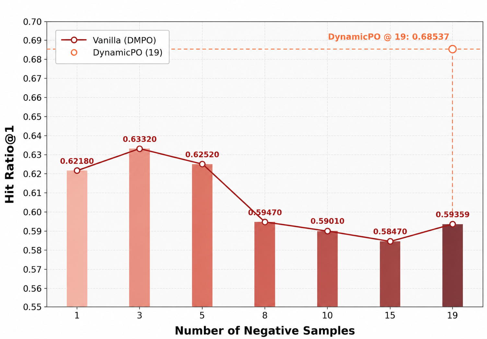
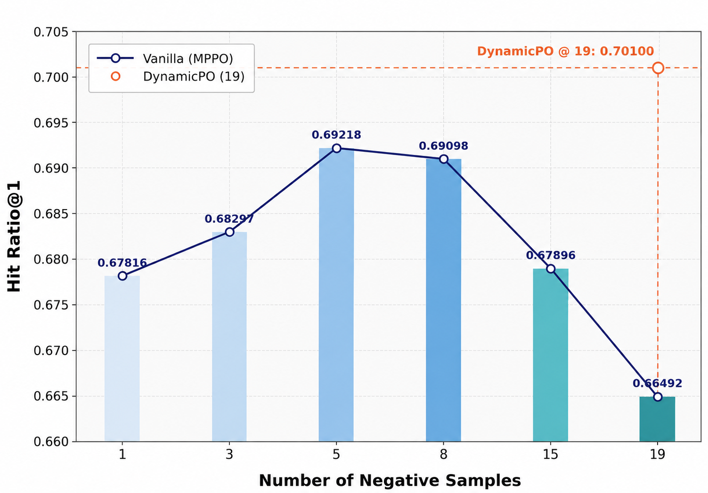
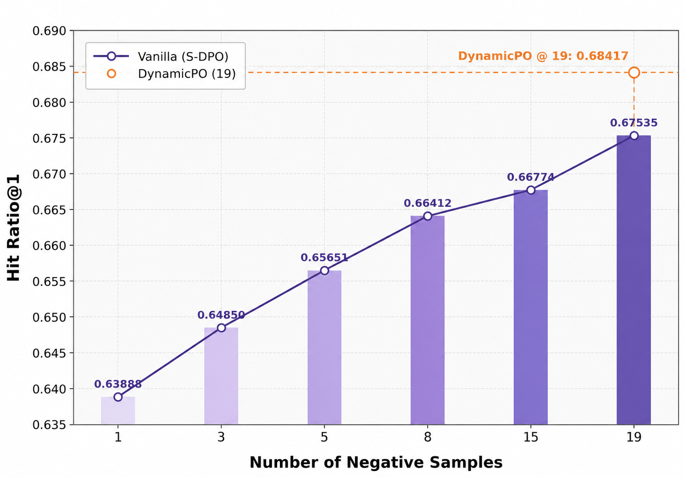

# DynamicPO

> Official implementation of "**DynamicPO: Dynamic Preference Optimization for Recommendation**"
>
> [](https://dasfaa2026.github.io/program/awards.html) [](https://huggingface.co/papers/2605.00327) [](https://huggingface.co/datasets/xingyuHuxingyu/DynamicPO-Data) [](https://huggingface.co/xingyuHuxingyu/DynamicPO)

> [!NOTE]
> 2026.6.24: We have completed the extended scaling experiments up to **19 negatives** for **DMPO**, **MPPO**, and **S-DPO**. More supplementary experiments, discussion, and **future directions** are provided in the appendix of the [arXiv](https://arxiv.org/abs/2605.00327) version.
>
> 2026.6.13: We expanded the negative-set analysis from **DMPO** to **MPPO** and **S-DPO** to further study the **preference optimization collapse** phenomenon.
>
> 2026.5.17: Our **NVIDIA H200** reproductions for both the **main experiments** and the **supplementary experiments** have been organized and uploaded to **Hugging Face**.
>
> 2026.5.13: We started reproducing the main and supplementary experiments on **NVIDIA H200** GPUs with **CUDA 13.1** (`nvcc 13.1.80`), while the paper-reported results are based on **A100** GPUs.

## 1. Summary of Paper

### 1.1 Preference Optimization Collapse in Multi-Negative Alignment

DynamicPO is a plug-and-play dynamic preference optimization framework for LLM-based recommender systems. It mitigates preference optimization collapse by dynamically identifying boundary-critical negatives and calibrating sample-level optimization strength.

Existing multi-negative preference optimization methods often assume that more negative samples provide richer preference supervision. However, our empirical study reveals a counterintuitive phenomenon: when the number of negatives continues to increase, recommendation performance can degrade even though the training loss keeps decreasing. We refer to this phenomenon as preference optimization collapse.

### 1.2 Lower Loss, Worse Recommendation: SFT-Induced Negative Imbalance

We find that this collapse is closely related to the negative imbalance induced by supervised fine-tuning. Although SFT does not explicitly perform positive-negative preference ranking, it already gives the model a coarse-grained ability to capture user interests. As a result, before preference optimization begins, many randomly sampled negatives have already been clearly separated from positives.

These model-discriminative negatives can dominate the aggregated optimization signal in multi-negative objectives and continue to drive the training loss downward. However, they provide limited information for refining fine-grained user preference boundaries. In contrast, boundary-critical negatives, which stay close to the current preference boundary or even violate the expected preference order, are more informative but can be diluted and under-optimized as the number of negatives increases.

### 1.3 DynamicPO: Boundary-Aware Dynamic Preference Optimization

DynamicPO addresses this issue by refocusing multi-negative preference optimization on **boundary-critical negatives**. It first prioritizes **preference-violation negatives** and then uses **likelihood-based clustering** to identify near-boundary negatives when no violation exists.

DynamicPO further applies **dual-margin dynamic β adjustment** to calibrate the optimization strength for each selected negative according to its boundary ambiguity. In this way, DynamicPO prevents optimization from being dominated by already separated negatives, enables more stable **preference-boundary refinement**, and remains **plug-and-play** across multiple multi-negative preference optimization objectives with **negligible computational overhead**. Experiments show that it effectively mitigates **preference optimization collapse** and improves recommendation performance across different LLM-based recommender settings.

> [!NOTE]
> Due to publisher page limits, more detailed discussion, supplementary results, and **future directions** are provided in the appendix of the [arXiv](https://arxiv.org/abs/2605.00327) version.

## 2. Installation

### 2.1 Requirements

- Python: `>=3.9`
- PyTorch: `2.4.0` or later
- Transformers: `4.43.3`
- Recommended hardware: we recommend 4 NVIDIA GPUs, such as A100, H100, or H200

### 2.2 Install Dependencies

Install dependencies with:

```bash
pip install -r requirements.txt
```

## 3. Data Preparation

Extract the LastFM dataset:

```bash
cd ./data
unzip lastfm-sft-cans20.zip
```

After extraction, the processed LastFM data will be available under `./data/`.
The extracted files include the processed splits used for supervised fine-tuning, preference optimization, and evaluation.

Our data preprocessing follows prior LLM-based recommendation work, mainly [LLaRA](https://arxiv.org/pdf/2312.02445), and the negative sampling strategy follows [S-DPO](https://arxiv.org/pdf/2406.09215).
We provide the processed **LastFM** data zip for quick reproduction in [`./data/`](/Users/huxingyu/DynamicPO/data), and the processed **Goodreads** and **Steam** data are also available in the Hugging Face Dataset release.
We recommend that future researchers use **LastFM** first when validating their ideas and reproducing the pipeline, and only then move to **Goodreads** and **Steam**, since these two datasets usually require more computation than **LastFM**.

## 4. Quick Start

The main experiment in this repository is the **DMPO-based DynamicPO pipeline**. We provide separate scripts for:

- `DMPO` baseline
- `DynamicPO_DMPO` main experiment

### Step 1. Supervised Fine-tuning (SFT)

Run:

```bash
sh ./scripts/01_sft/sft.sh
```

This produces the SFT checkpoint used by the preference-optimization stage.

### Step 2. Preference Optimization

For the DMPO baseline, run:

```bash
sh ./scripts/02_preference_optimization/DMPO.sh
```

For the DynamicPO-DMPO main experiment, run:

```bash
sh ./scripts/02_preference_optimization/DynamicPO_DMPO.sh
```

Both scripts launch `DynamicPO.py`, which uses `trainer/dynamicpo_trainer.py`.

Before running the scripts, please check the following variables:

- `MODEL_NAME`: path or name of the base model
- `SFT_CHECKPOINT`: path to the SFT checkpoint
- `NEG_NUM`: number of negative samples, set to **`15`** in our main experiments

The scripts already contain the recommended training settings. In most cases, you only need to update `MODEL_NAME` and `SFT_CHECKPOINT`.

### Step 3. Inference

Run:

```bash
sh ./scripts/03_inference/inference.sh
```

You may append `&` to run the scripts in the background.

## 5. Results

A compact summary of the most important tables is shown below. All reported metrics below are `HitRatio@1`.

For the broader comparison setting, we adopt the reported results of the traditional and LLM-based baselines from [LLaRA](https://arxiv.org/pdf/2312.02445) and [S-DPO](https://arxiv.org/pdf/2406.09215), and we follow the same dataset construction and evaluation protocols used in those works. Please refer to our [arXiv paper](https://arxiv.org/abs/2605.00327) for the full main-experiment comparison.

> [!TIP]
> The paper-reported results in Sections **5.1** to **5.3** were obtained on **A100** GPUs. To support reproduction and checkpoint release, we also report the latest **H200** runs in Section **5.4**. Small differences across environments, such as **CUDA / NVCC versions** and **GPU types** (for example, A100, H100, or H200), are normal and should be expected.

### 5.1 Paper-Reported Main Results on A100

#### DMPO

| Variant | LastFM HR@1 | Goodreads HR@1 | Steam HR@1 |
| --- | ---: | ---: | ---: |
| Vanilla | 0.5848 | 0.5349 | 0.6383 |
| DynamicPO | 0.6661 | 0.6728 | 0.6990 |

#### MPPO

| Variant | LastFM HR@1 | Goodreads HR@1 | Steam HR@1 |
| --- | ---: | ---: | ---: |
| Vanilla | 0.6597 | 0.6993 | 0.7614 |
| DynamicPO | 0.6906 | 0.7226 | 0.8069 |

#### S-DPO

| Variant | LastFM HR@1 | Goodreads HR@1 | Steam HR@1 |
| --- | ---: | ---: | ---: |
| Vanilla | 0.6617 | 0.6778 | 0.6948 |
| DynamicPO | 0.6666 | 0.6843 | 0.6998 |

### 5.2 Paper-Reported Cross-backbone Generalization on A100

| Base Model | Variant | LastFM HR@1 | Goodreads HR@1 |
| --- | --- | ---: | ---: |
| Llama3-8B-Instruct | Vanilla | 0.6232 | 0.6645 |
| Llama3-8B-Instruct | DynamicPO | 0.7331 | 0.7641 |
| Qwen2.5-7B-Instruct | Vanilla | 0.5892 | 0.6617 |
| Qwen2.5-7B-Instruct | DynamicPO | 0.6433 | 0.7359 |

### 5.3 Paper-Reported Efficiency and Training Dynamics on A100

| Base Model | Vanilla DMPO | DynamicPO | Overhead |
| --- | --- | --- | --- |
| Llama2-7b-hf | 4·A100 × 16h38min | 4·A100 × 16h41min | +3min |
| Llama3-8B-Instruct | 4·A100 × 15h29min | 4·A100 × 15h42min | +13min |
| Qwen2.5-7B-Instruct | 4·A100 × 14h49min | 4·A100 × 14h57min | +8min |
| Average | 62.58 h·A100 | 63.11 h·A100 | +0.85% |

<table>
  <tr>
    <td align="center" width="50%">
      
      <br>
      <sub><b>Figure 4a.</b> Negative sample scaling.</sub>
    </td>
    <td align="center" width="50%">
      
      <br>
      <sub><b>Figure 4b.</b> Reward win rate during training.</sub>
    </td>
  </tr>
</table>

### 5.4 Latest H200 Reproduction Results for Reproduction and Checkpoint Release

The tables below report our latest reproduced results on **NVIDIA H200** GPUs with **CUDA 13.1 (nvcc 13.1.80)**. These numbers are slightly different from the paper-reported results because the paper results are based on **NVIDIA A100** GPUs. We keep both versions here for transparency. The corresponding reproduced checkpoints on **NVIDIA H200** have been released on **Hugging Face**.

#### Generalization across Multi-Negative Preference Optimization Objectives: DMPO, MPPO, and S-DPO (Llama2-7B)

| Objective | Vanilla | DynamicPO |
| :-- | --: | --: |
| DMPO | 0.58757 | **0.67535** |
| MPPO | 0.67454 | **0.69419** |
| S-DPO | 0.66774 | **0.67575** |

#### Effectiveness of DynamicPO across Different Backbone Language Models (DMPO)

| Backbone | Vanilla | DynamicPO |
| :-- | --: | --: |
| Llama2-7b-hf | 0.58757 | **0.67535** |
| Llama3-8B-Instruct | 0.60481 | **0.73106** |
| Qwen2.5-7B-Instruct | 0.56874 | **0.64529** |


## 6. Supplementary Multi-objective Experiments

This supplementary section provides additional scripts for evaluating DynamicPO on other multi-negative preference optimization objectives. These experiments are **not the default Quick Start path** of this repository, but correspond to the **multi-objective generalization study** reported in the paper.

### 6.1 MPPO and S-DPO Extensions

It includes two objective families:

- MPPO and DynamicPO-MPPO
- S-DPO and DynamicPO-S-DPO

The runnable entrypoint is `exploratory_study.py`, which uses `trainer/exploratory_study_trainer.py`.

### 6.2 Extended Negative-Set Scaling to 19 Negatives

To further examine whether **preference optimization collapse** generalizes across different multi-negative objectives, we extend the maximum number of negatives from `15` to `19` on **LastFM** and analyze the complete scaling behavior of vanilla **DMPO**, **MPPO**, and **S-DPO**. These supplementary scaling experiments are conducted on **NVIDIA H200** GPUs, and the corresponding checkpoints are released on **Hugging Face**.

<table>
  <tr>
    <td align="center" width="33%">
      
      <br>
      <sub><b>DMPO.</b> Scaling behavior as the number of negative samples increases.</sub>
    </td>
    <td align="center" width="33%">
      
      <br>
      <sub><b>MPPO.</b> Scaling behavior as the number of negative samples increases.</sub>
    </td>
    <td align="center" width="33%">
      
      <br>
      <sub><b>S-DPO.</b> Scaling behavior as the number of negative samples increases.</sub>
    </td>
  </tr>
</table>

These curves show that **DMPO** and **MPPO** both exhibit non-monotonic scaling behavior as the negative set grows, while **S-DPO** remains comparatively stable within the evaluated range. DynamicPO improves all three objectives under the enlarged negative-set setting, further supporting its generalization across different multi-negative preference optimization formulations.

### 6.3 Reproducing Supplementary Comparisons

Run one of the following scripts:

```bash
sh ./scripts/exploratory_study/MPPO/MPPO.sh
sh ./scripts/exploratory_study/MPPO/DynamicPO_MPPO.sh
sh ./scripts/exploratory_study/SDPO/SDPO.sh
sh ./scripts/exploratory_study/SDPO/DynamicPO_SDPO.sh
```

In most cases, you only need to check:

- `MODEL_NAME`
- `SFT_CHECKPOINT`

For the objective-specific setting:

- `MPPO` / `DynamicPO_MPPO`: use `loss_type="wo_ref"`
- `SDPO` / `DynamicPO_SDPO`: use `loss_type="w_ref"`

For a clear comparison, we recommend reproducing each family as a pair:

1. `MPPO` vs. `DynamicPO_MPPO`
2. `SDPO` vs. `DynamicPO_SDPO`

You can also vary the number of negative samples, such as `1`, `3`, `5`, `10`, `15`, and `19`, to examine how preference-optimization collapse changes under different multi-negative settings.

### 6.4 What We Learned from the Supplementary Experiments

- **DMPO** and **MPPO** both show non-monotonic scaling behavior as the negative set grows, but **DMPO collapses earlier and more sharply**, while **MPPO** tolerates larger negative sets before degrading.
- **S-DPO** remains comparatively stable within the evaluated range up to `19` negatives, but this stability does **not** imply uniform objective superiority.
- After applying **DynamicPO**, **DMPO**, **MPPO**, and **S-DPO** all improve clearly, and each surpasses **vanilla S-DPO** under the same setting.
- **DynamicPO** improves **DMPO**, **MPPO**, and **S-DPO** under enlarged negative-set settings, suggesting encouraging generalization across different multi-negative preference optimization objectives. More details are provided in the [arXiv appendix](https://arxiv.org/abs/2605.00327).

## 7. Future Directions

- Study **dynamic-β** more systematically, especially its effects on gradient allocation, training stability, and preference-boundary refinement.
- Extend **DynamicPO beyond recommendation** to broader LLM alignment settings such as dialogue, question answering, and instruction following.
- Explore whether the same boundary-aware principle can also benefit **online RL** methods such as PPO and GRPO.

## Project Structure

```text
DynamicPO/
├── data/
├── prompt/
├── scripts/
│   ├── 01_sft/
│   ├── 02_preference_optimization/
│   ├── 03_inference/
│   └── exploratory_study/
├── trainer/
├── DynamicPO.py
└── exploratory_study.py
```

## Base Objective Forms

The following equations summarize the **base multi-negative objective forms** used in this repository. DynamicPO further augments these objectives with **dynamic boundary-negative selection** and **sample-level dynamic β adjustment**. Please refer to their original papers for the full derivations.

**[DMPO](https://dl.acm.org/doi/10.1145/3627673.3679611)**

```math
\mathcal{L}_{\mathrm{DMPO}}(\pi_\theta; \pi_{\mathrm{ref}})
=
- 
\mathbb{E}_{(x_u, y_w, y_l) \sim \mathcal{D}}
\left[
\log \sigma
\left(
\beta \log
\frac{\pi_\theta(y_w \mid x_u)}
{\pi_{\mathrm{ref}}(y_w \mid x_u)}
-
\frac{1}{k}
\sum_{i=1}^{k}
\beta \log
\frac{\pi_\theta(y_i \mid x_u)}
{\pi_{\mathrm{ref}}(y_i \mid x_u)}
\right)
\right]
```

**[MPPO](https://arxiv.org/abs/2412.15244)**

```math
\mathcal{L}_{\mathrm{MPPO}}(\pi_\theta)
=
-
\mathbb{E}
\left[
\log \sigma
\left(
N \cdot \pi_\theta(y_w \mid x)
-
\sum_{i=1}^{N}
\pi_\theta(y_{l_i} \mid x)
\right)
\right]
```

**[S-DPO](https://arxiv.org/abs/2406.09215)**

```math
\mathcal{L}_{\mathrm{S\text{-}DPO}}(\pi_\theta; \pi_{\mathrm{ref}})
=
-
\mathbb{E}_{(x_u, e_p, \mathcal{E}_d) \sim \mathcal{D}}
\left[
\log \sigma
\left(
-
\log
\sum_{e_d \in \mathcal{E}_d}
\exp
\left(
\beta \log
\frac{\pi_\theta(e_d \mid x_u)}
{\pi_{\mathrm{ref}}(e_d \mid x_u)}
-
\beta \log
\frac{\pi_\theta(e_p \mid x_u)}
{\pi_{\mathrm{ref}}(e_p \mid x_u)}
\right)
\right)
\right]
```

## Citation

This work received the **DASFAA 2026 Best Paper Award**. If you find our work useful, please consider giving us a ⭐ and citing our paper:

```bibtex
@inproceedings{hu2026dynamicpo,
  title={DynamicPO: Dynamic Preference Optimization for Recommendation},
  author={Hu, Xingyu and Zhang, Kai and Wu, Jiancan and Wang, Shuli and Wang, Chi and Chen, Wenshuai and Zhu, Yinhua and Wang, Haitao and Wang, Xingxing and Wang, Xiang},
  booktitle={International Conference on Database Systems for Advanced Applications},
  pages={372--387},
  year={2026},
  organization={Springer}
}
```

## Acknowledgment

This implementation is built upon the [TRL library](https://github.com/huggingface/trl).
We sincerely thank the authors of [DMPO](https://github.com/BZX667/DMPO), [MPPO](https://arxiv.org/abs/2412.15244), [S-DPO](https://github.com/chenyuxin1999/S-DPO), and [LLaRA](https://arxiv.org/pdf/2312.02445) for their valuable work on LLM-based recommendation and multi-negative preference optimization, which provide important foundations for this research direction.
